# ζ(9) 本地定理 DAG

本图是下一步研究的**本地数学依赖图**。状态“笔记已证”表示工作区中的证明与证书，并不表示 Lean 检查或 Prove2me 接受。根节点保持开放。机器可读节点、归约边和研究输入见 [dag.json](dag.json)。已启动的 Prove2me 私有 mission 见[平台回执](platform/proposal-receipt.json)：截至 2026-09-25，状态为 `Private`，已回读 32 个新研究里程碑及开放的根定理；平台另有两个已接受的通用归约证明，以及[三个新结果的已接受抽象核心](platform/new-results-receipt.json)。这些抽象定理的范围见[对应表](platform/new-dag-mapping.md)；具体的 J、T、TS、T5、TG、FD、CP、V、S、VA、VB、VC、VD 还没有忠实的 Lean 定义或平台定理项。新证明的 Taylor 连接 TA、鞍点 SP、高斯窗 GC、五点求积 FQ、比值窗 FI、第一输出逼近 FO、端点间隔 FC、有理替代模型 FM、真实面积下界 XL 与临界判据 CM 仅有数学笔记和局部核验。

## 对象和量词

始终取偶数 `n≥2`、第六至九轮的 `p=9, m=n, deg W≤4` 构造。`F_n` 的行是 `u^0,…,u^4`，列是 `(B,A₃,A₅,A₇,A₉)`，`u=t(t+n)`；`S` 选择 `B,A₉` 两列，`E_n=S F_n⁻¹` 是二元输出的五维逆像。`K_n` 是低 ζ 整核的**饱和**整数基，`D_n` 是原始二元像的共同正分母，`s₁,n|s₂,n` 是其 Smith 因子，`N_n=s₂,n/s₁,n`，`d_n=lcm(1,…,n)`，固定 `g_n=gcd(N_n,d_n²)`。

每个五维向量使用权重 `diag(1,n²,n⁴,n⁶,n⁸)` 的欧氏范数。令 `Δ_n` 为加权 `K_n` 行格的二维面积，`μ_n=μ₁(Λ_{g_n})`。所有量都严格为正。阈值 `τ=2641/250=10.564`，已证实侧指数 `f_*<-τ`。定义

\[
B_n=\frac{\log(D_n/s_{1,n})+\tfrac12\log\Delta_n-\tfrac12\log g_n}{n},\qquad
\sigma_n=\frac{\tfrac12\log(g_n\Delta_n)-\log\mu_n}{n}.
\]

因此 **精确地** `B_n+σ_n=[log(D_n/s₁,n)+log Δ_n−log μ_n]/n`。这里 `B_n` 是算术体积基线，不是形式常数系数 `B(W)`。

## 节点与边

实线是经过数学推导的充分归约或已证节点的实际证明依赖；同一个归约 ID 下的子边需要**共同成立**，不同归约 ID 是可选路线。虚线只表示研究输入，**不能单独完成父节点**。

```mermaid
graph TD
  R["R: ζ(9) 无理 · 开放"] --> J["J: 无穷子序列指数裕量 · 开放"]
  R --> CP["CP: 第二极小值临界多项式裕量 · 开放"]
  R --> CM["CM: 临界裕量与无理性等价 · 笔记已证"]
  R --> TC["T: 完整像格第一向量无穷次定号 · 开放"]
  R --> TS["TS: 完整像格第一向量无穷次鞍点定号 · 开放"]
  R --> T5["T5: 第一向量无穷次五点定号 · 开放"]
  R --> TG["TG: 部分同余格第一向量无穷次定号 · 开放"]
  R --> TP["TP: 正号单形式与 B−sigma 提升 · 笔记已证"]
  R --> SP["SP: 鞍点局部定号则全和非零 · 笔记已证"]
  R --> FQ["FQ: 五个预定实取样的精确正求积 · 笔记已证"]
  R --> X["X: 逆像面积统一指数界 · 笔记已证"]
  R --> V["V: limsup B_n < 10.564 · 开放"]
  R --> F["F: 形式矩阵与逆像 · 笔记已证"]
  R --> A["A: 正矩衰减 · 笔记已证"]
  R --> G["G: Smith 格与第二极小值 · 笔记已证"]
  R --> P["P: 两条整数形式准则 · 笔记已证"]
  J --> V
  T5 --> TS
  T5 --> FD["FD: 端点分母与第一高度乘积无穷次 ≤1 · 开放"]
  T5 --> FC["FC: 精确端点分母和整数间隔 · 笔记已证"]
  FQ --> GC["GC: 高斯矩极限与锐常数窗 · 笔记已证"]
  J --> SN["S: sigma_n -> 0 · 开放"]
  V --> VA["VA: N/g 的严格算术指数 · 开放"]
  V --> Q["Q: Smith 内容消去 · 笔记已证"]
  V --> X
  VA --> VB["VB: 小、大素数误差预算 · 开放"]
  VA --> Y["Y: 逐素数预算不等式 · 笔记已证"]
  VA --> VD["VD: 折扣后中间素数预算 · 开放"]
  VA --> YD["YD: 精确素数折扣恒等式 · 笔记已证"]
  VA --> H["H: p>n 的平移迹消去 · 笔记已证"]
  VA --> Z["Z: 小素数贡献 o(n) · 笔记已证"]
  VB --> VC["VC: 中间素数超额率 · 开放"]
  VB --> H
  VB --> Z
  VC -.研究输入.-> I["I: 中间素数合并极点界 · 笔记已证"]
  VD -.研究输入.-> I
  V -.研究输入.-> M["M: 行列式与子式 gcd · 笔记已证"]
  V -.研究输入.-> C["C: 饱和整数核加权面积 · 笔记已证"]
  SN -.研究输入.-> L["L: primitive 同余公式 · 笔记已证"]
  SN -.研究输入.-> LC["LC: 内禀逐素数斜率 · 笔记已证"]
  TG -.研究输入.-> LC
  TC -.研究输入.-> TA["TA: 两步 Taylor 连接最终保正 · 笔记已证"]
  TG -.研究输入.-> TA
  TS -.研究输入.-> TA
  T5 -.研究输入.-> TA
  T5 -.研究输入.-> GO["GO: 仅靠二维几何不能推出五点定号 · 笔记已证"]
  T5 -.研究输入.-> FI["FI: 五点严格比值窗与斜率判据 · 笔记已证"]
  T5 -.研究输入.-> FO["FO: 全部第一输出一致逼近 ζ · 笔记已证"]
  T5 -.研究输入.-> FM["FM: 同谱有理连接仍可永远变号 · 笔记已证"]
  T5 -.研究输入.-> XL["XL: 真实面积下界与第一高度上界 · 笔记已证"]
  V -.研究输入.-> XL
  FI --> FQ
  FI --> TA
  FO --> TA
  FO --> X
  FC --> FI
  FC --> M
  XL --> TA
  XL --> FC
  CM --> F
  CM --> TA
  CM --> GC
  CM --> X
  H --> M
  Z --> M
  LC --> L
  I --> M
```



`J` 的**真正目标**是：存在 `ε>0` 和无穷多个偶数 `n`，使 `B_n+σ_n≤τ−ε`。`V` 与 `S` 分别要求沿**全部**趋于无穷的偶数 `n` 有 `limsup B_n<τ`、`σ_n→0`。它们是更强的候选分解，不是 `J` 的必要条件。若其中一个被严格否定，保留 `J` 并寻找一个共同的显式无穷子序列；有限反例不否定极限陈述。

## J to root

由 [第七轮算术证明](../round7/research/arithmetic.md) 的同一加权范数下的二维 Gauss 界，

\[
\lambda_2(E_n)\le\frac2{\sqrt3}\frac{D_n}{s_{1,n}}\frac{\Delta_n}{\mu_n},
\quad
\frac1n\log\lambda_2(E_n)\le B_n+\sigma_n+\frac1n\log\frac2{\sqrt3}.
\]

若 `J` 成立，则沿其无穷子序列，充分大时 `λ₂(E_n)≤exp((τ−ε/2)n)`。第二逐次极小值的定义提供两个独立整数输出 `z₁,n,z₂,n∈Z²`，其逆像 `wᵢ,n=zᵢ,n E_n` 的**加权欧氏范数**均不大于该上界；`E_n` 单射，故输出也独立。若逐次极小值的最小值只以闭球之外的上确界定义，增大一个 `exp(o(n))` 因子即可，指数裕量不变。

第七轮解析证明对任意这样的 `w` 给出统一的

\[
|L_n(w)|\le e^{(-\tau+o(1))n}\sum_{r=0}^4|w_r|n^{2r}
\le\sqrt5\,e^{(-\tau+o(1))n}\|w\|_{n,2}.
\]

于是两条形式 `L_n(wᵢ,n)=bᵢ,n+aᵢ,n ζ(9)` 同时趋零。若 `ζ(9)=c/d∈Q`，`dL_n(wᵢ,n)` 是整数；两条输出独立，不能同时落在唯一零关系直线上，所以至少一条是非零整数。它的绝对值又趋零，矛盾。这使用的是已证的形式映射与两方向准则，不预设其他奇 ζ 值独立。

## Critical second-minimum route to root

[CM 的临界判据](research/critical-polynomial-margin.md)把双形式路线提高到真实核的多项式尺度。令 `Z_n=Σ_{k>n}R_n(k)`，`α=−f_*`，`T_n=n⁵e^{αn}`；已证完整鞍点渐近为 `Z_n∼C_Z/T_n`。正 Taylor 矩使两个固定坐标行的加权范数均为 `Θ(T_n)`，而逆像面积上界使归一化两行渐近共线。由此严格证明

\[
 \boxed{\zeta(9)\notin\mathbb Q
 \iff \lambda_{2,n}=o(T_n)
 \iff \liminf_{2\mid n,\,n\to\infty}\lambda_{2,n}Z_n=0
 \iff \frac{\lambda_{1,n}}{\Xi_nZ_n}\to\infty.}
\]

开放节点 CP 只要求其中较弱、仍足以推出根的 `liminf λ₂,n Z_n=0`。若 `ζ(9)=c/d` 为既约有理数，任意两个独立整数输出中至少一个非零形式有绝对值 `≥1/d`，所以 `liminf λ₂,n/T_n≥1/(dC_Z‖v_*‖)>0`；这证明归约 `CP+CM⇒R`。反向则取两条**固定**的独立连分数近似，令其形式值任意小，再使 `n→∞`，证明 `λ₂,n/T_n→0`。这是一条真正等价的几何判据，**并未证明 CP**。有理假设下还可精确描述格形：唯一第一 primitive 方向最终是零关系 `±(-c,d)`，且 `λ₁,n λ₂,n/Ξ_n→1`。已证 J 的指数裕量会推出 CP；CP 所需的临界 `n⁵` 改进可能比 J 的固定指数裕量更宽，但现有谱上界不足以建立它。

## Full lattice positive direction to root

[单形式正号准则](research/shape-or-j-next.md)给出一个不经 J 的严格归约。令 \(\lambda_{1,n}\) 为完整整数输出格 \(\mathbb Z^2E_n\) 的加权第一极小值。[X](research/inverse-area-rate.md) 的统一面积上界和二维 Hermite 不等式给

\[
\lambda_{1,n}^2\le\frac2{\sqrt3}\Xi_n,\qquad
\limsup_{2\mid n,\,n\to\infty}\frac{\log\lambda_{1,n}}n
<\gamma=\tfrac14\log(3\,711\,015\,000)<\tau.
\]

新开放节点 T 要求：在无穷多个偶数 \(n\) 上，完整像格某个第一极小向量 \(z_nE_n\) 的权多项式在 \(u_0=(n+1)(2n+1)\) 的五个 Taylor 系数同为弱正或同为弱负。它非零，且在 \(u(k)=k(k+n)\)、\(k>n\) 的全部取样点同号，至少一个取样值严格非零。因 \(R_n(k)>0\)，其和 \(b_n+a_n\zeta(9)\) 严格非零。上述第一极小值界及 [A](../round7/research/analytic.md) 又使该整数输出形式趋零。若 \(\zeta(9)\) 有理，清固定分母便得到趋零的非零整数，矛盾。因此 T、TP、X、A、F 合取推出 R。

完整 \(N_n\) 格的五个冻结 Gauss 证书中，\(n=24,192\) 的第一多项式在 \((u_0,\infty)\) 各有一个精确 Sturm 根；\(n=12,48,96\) 的第一向量定号。这些有限事实都不决定 T 的无穷命题。根节点仍开放。

[TA 的统一证明](research/taylor-connection-next.md)表明：归一化 Taylor 行的真实 \(n\to n+4\) 传递最终是严格正矩阵；每个**固定**的非零实值输出，其五个 Taylor 系数最终均与实值同号。特别地，两个坐标输出的十个系数最终全正，五个比值的最小值和最大值沿各自模 \(4\) 子序列夹住 \(\zeta(9)\)，严格嵌套并指数收缩。[谱率证明](research/taylor-window-rate.md)进一步给出窗口宽度的统一指数上界 \(\limsup n^{-1}\log I_n<-10.1109\)：正两步矩阵的 Perron 向量控制每个分母坐标，外积谱控制全部子式分子。[精确矩阵核验](verification/check_taylor_transfer.py)检查极限矩阵的有理共轭式和正平方。T 仍要求随 \(n\) 变化的最短整数方向；固定方向的入锥时间没有统一到这些方向上。有限 \(n=2\) 的比值严格递减，也阻止把五个 \(n\equiv0\pmod4\) 样本中的递增顺序外推到全部偶数。

## Saddle-signed first direction to root

[SP 的统一证明](research/full-lattice-sign-next.md)把 T 所要求的全尾定号放宽为鞍点附近的实际取样定号。设 \(x_*\) 是已证正核相位的唯一极大点。对任意预先规定且满足 \(h_n\to0\)、\(nh_n^2/\log n\to\infty\) 的正窗口列，全部充分大偶数 \(n\) 和任意非零四次以下实多项式 \(q\)，若 \(q(k(k+n)/n^2)\) 在所有满足 \(|k/n-x_*|\le h_n\) 的 \(k>n\) 上弱同号，则完整无穷和 \(\sum_{k>n}R_n(k)q(k(k+n)/n^2)\) 严格非零。证明在中心五个相邻采样点用四次插值给出 \(n^{-4}\) 级相对下界；窗外的完整无穷尾项则比峰值小 \(e^{-cnh_n^2}\) 乘多项式因子。特别可取任意固定 \(A_0>0\) 的 \(h_n=A_0(\log n)/\sqrt n\)。

新开放节点 TS 要求存在一个预先固定的 \(A_0>0\)，使无穷多个充分大偶数 \(n\) 的完整像格某个第一极小整数输出，在 \(|k/n-x_*|\le A_0(\log n)/\sqrt n\) 的实际取样上同号。由 X 的面积界与 Hermite 不等式，该第一向量有严格低于 \(\tau\) 的长度指数；A 给出其线性形式趋零，而 SP 给出每个形式严格非零。若 \(\zeta(9)\) 有理，清固定分母便得到趋零的非零整数，矛盾。因此 TS、SP、X、A、F 合取推出 R。两个冻结参数 \(n=24,192\) 的第一多项式虽在半轴有实根，其完整正核和仍由[精确有限证书](verification/check_signed_saddle_samples.py)证明为负；它们不能推出 TS。

## Five-sample first direction to root

[GC 的证明](research/moving-short-sign-next.md)首先对**真实的无穷正核**证明局部高斯矩极限。置 `a=−f''(x_*)>0`、`y_*=x_*(x_*+1)`、`Z_n=Σ_{k>n}R_n(k)`，并用与 `y=k(k+n)/n²` 仿射的变量

\[
s_{n,k}=\frac{\sqrt{an}}{2x_*+1}\left(\frac{k(k+n)}{n^2}-y_*\right).
\]

归一化的零至四阶矩趋向标准高斯矩 `(1,0,1,0,3)`；证明包括 `k≥10n` 的完整无穷尾，不能只截断有限个 `k`。[精确有理证书](verification/check_gaussian_five_point.py)给 `330.658<a<330.659` 及锐阈值 `0.095251<√(3/a)<0.095252`。对任意固定 `A>√(3/a)`，所有充分大偶数和**所有随 n 变化**的非零四次多项式，若在 `|k/n−x_*|≤A/√n` 的全部真实取样弱同号，则完整和严格同号。任意 `A<√(3/a)` 都有移动四次多项式的严格反例；这些反例没有被证明落在实际整数输出平面。边界等号未决。

[FQ 的证明](research/moving-short-sign-next.md#6-五个预定实际取样点的精确正求积)给更简单的判据。预定五个整数

\[
k_{n,j}=\left\lfloor nx_*+j\sqrt{n/a}+\tfrac12\right\rfloor,
\qquad j=-2,-1,0,1,2.
\]

充分大时它们互异且都大于 `n`。对每个充分大偶数 `n`，存在与多项式无关的五个**严格正**的精确权重 `ω_{n,j}`，使任意四次以下 `q` 满足

\[
\sum_{k>n}R_n(k)q\!\left(\frac{k(k+n)}{n^2}\right)
=Z_n\sum_{j=-2}^{2}\omega_{n,j}
q\!\left(\frac{k_{n,j}(k_{n,j}+n)}{n^2}\right).
\]

这不是近似求和：五个权重由真实核的零至四阶矩和五点 Vandermonde 逆矩阵定义。矩极限保证它们趋向 `(1/12,1/6,1/2,1/6,1/12)`，所以最终逐项为正；`s` 与 `y` 仿射保证该恒等式对四次 `q` **精确**成立。非零四次多项式不可能在五个不同点全为零。因而五个值弱同号就使完整无穷和严格同号，不需要检查点与点之间的符号。

开放节点 T5 要求：无穷多个充分大偶数 `n` 的完整整数输出格有一个第一极小向量 `z_nE_n`，其权多项式 `P_n(u)` 在这五个预定 `u=k_{n,j}(k_{n,j}+n)` 处弱同号。令 `q_n(y)=P_n(n²y)`，FQ 给 `L_n(z_nE_n)=b_n+a_nζ(9)≠0`。由 X 与二维 Hermite 界，`‖z_nE_n‖_{n,2}≤exp((τ−ε)n)` 对全部充分大偶数、某个固定 `ε>0` 成立；A 给出这些非零形式沿 T5 的无穷子序列趋零。若 `ζ(9)=c/d` 有理，则 `d(b_n+a_nζ(9))` 是非零整数却趋零，矛盾。故 **T5、FQ、X、A、F 合取推出 R**，而 T5 仍开放。对任意固定 `A_0>0`，五点最终落在 `A_0(log n)/√n` 的鞍点窗内；因此已定义的较强开放节点 TS 蕴含 T5。

若反设 `ζ(9)` 有理，固定零关系方向的多项式在这五点中必须同时有正值和负值，否则 FQ 与零和矛盾。这是研究整数方向的必要条件，还没有与实际格的最短性形成矛盾。

[GO 的抽象反例](research/five-point-geometry-obstruction.md)进一步限定了可行的证明路线：对每个充分大偶数 `n`，可以构造一个秩二**整数多项式格**，其全部非零向量在五点中的三个指定点就同时出现正值和负值；即使把面积率与第一极小长度率调到 `5`，仍满足现有 X 与 Hermite 给的上界。这不是实际 `E_n` 的反例，却严格排除“只由二维性、面积和短度上界推出 T5”的抽象论证。下一步须利用实际逆像行的方向、连接或算术信息。

[FI 的五点比值窗](research/five-point-ratio-window.md)把 T5 进一步化为一条精确的有理斜率条件。TA 使两个坐标多项式 `Q_n^B=q_{n,(1,0)}`、`Q_n^A=q_{n,(0,1)}` 在五点最终严格为正；令 `r_{n,j}=Q_n^A(y_{n,j})/Q_n^B(y_{n,j})`、`ℓ_n=min_j r_{n,j}`、`h_n=max_j r_{n,j}`。FQ 的正权重和两个坐标的真实和 `1,ζ(9)` 给出 `ℓ_n<ζ(9)<h_n`，非退化性来自 `E_n` 行秩二。每个五点比值又是 TA 五个 Taylor 比值的严格凸组合，所以五点窗严格位于 Taylor 窗内，并继承宽度指数率 `<−10.1109`。对整数输出 `(b,a)`，五点弱同号等价于 `a=0` 或 `−b/a∉(ℓ_n,h_n)`；端点**允许**零值，不能误写为避开闭区间。故 T5 的实际缺口是控制移动第一输出的有理斜率，证明它无穷次落在这个开窗之外。

## Endpoint-denominator route to five-sample sign

[FC 的精确算术笔记](research/t5-arithmetic-next.md)将五点有理端点的既约分母写为原矩阵伴随行在实际整数样本 `t=k(k+n)` 的求值 gcd。记 `ℓ_n=P_-/Q_-`、`h_n=P_+/Q_+`，其中 `Q_±>0`、`w_n=h_n−ℓ_n>0`；令 `U_{B,n}=(1,0)E_nW_n`、`Ξ_n=area(Z²E_nW_n)`、`λ_{1,n}` 为其第一极小长度。对任何斜率 `p=−b/a∈(ℓ_n,h_n)` 的整数输出，两个端点的整数行列式非零，故

\[
 |a|w_n>\frac1{\min(Q_-,Q_+)}.
\]

另一方面，外积恒等式 `|a|Ξ_n=‖(b,a)E_nW_n∧U_{B,n}‖` 使**每个**第一输出满足 `|a|≤λ_{1,n}‖U_{B,n}‖/Ξ_n`。因此新开放节点 FD 若能证明无穷多个充分大偶数参数满足

\[
 \boxed{\frac{\lambda_{1,n}\|U_{B,n}\|}{\Xi_n}\,
 w_n\min(Q_-,Q_+)\le1,}
\]

这些参数的全部第一输出都避开五点开窗，FC 与 FI 便推出 T5。FD 是充分加强条件；未知的端点**求值后** gcd 使其目前没有无穷证明。若 `ζ(9)=c/d` 为既约有理数，严格夹逼反而强制 `d w_n\min(Q_-,Q_+)>1`，所以窗口宽度的指数收缩本身不会给出 FD。

[FO 的统一逼近定理](research/t5-transfer-next.md)证明：令 `A=λ₁>0`、`B=|λ₂|` 是极限连接的前两特征模，`δ=¼log(A/B)>5.05545`；对每个 `ε∈(0,δ)`，全部充分大偶数 `n` 的**所有**第一输出 `(b,a)` 都有 `a≠0` 与 `|b+aζ(9)|≤exp(−(δ−ε)n)`。若 ζ(9) 有理，这些第一输出最终恰为唯一 primitive 零关系方向的正负号；这与持续留在五点开窗内相容。[FM 的有理替代连接](research/t5-transfer-next.md#3-同一谱极限正求积与有理输出仍容许-t5-永久失败)甚至保留相同谱极限、两步正性、五个实际节点与精确正求积而使 T5 最终全失败，但不保留真实有限参数连接 `C(n)`。故极限谱和正性本身无法补上 FD 或 T5。

[XL 的真实面积下界](research/inverse-area-lower-next.md)证明 `‖U_{B,n}‖` 的精确指数为 `½log A`，并以真实正矩列保持零实值行与主行的夹角，得到 `liminf log Ξ_n/(2n)≥¼log(A|λ₅|)>¼log(1499/10)`。这给全部第一输出的高度上指数 `≤¼log(A/|λ₅|)<¼log(1499400000·10000000)`。若要把该高度界推进到临界值 `δ`，还需证明真实零实值行的下增长率达到 `½log|λ₂|`；冻结矩阵的非零投影不保证变系数递推中的这一点。XL 不证明 FD，也不证明 T5。

## Partial lattice positive direction to root

令 \(v_n\) 是 \(\Lambda_{g_n}\) 的加权第一向量，长度 \(\mu_n\)。第七轮 Smith 格等式把 \((N_n/g_n)v_n\in\Lambda_{N_n}\) 提升为某个实际整数输出 \(z_n\)，且有精确长度关系

\[
z_nE_n=\frac{D_n}{s_{1,n}g_n}v_n,\qquad
\frac1n\log\|z_nE_n\|_{n,2}=B_n-\sigma_n.
\]

二维 Hermite 界给 \(\sigma_n\ge-\log(2/\sqrt3)/(2n)\)。因此若 V 的 \(\limsup B_n<\tau\) 成立，提升后的第一向量对全部充分大偶数 \(n\) 都有统一的指数短度。新开放节点 TG 只要求其中无穷多个向量的五个 Taylor 系数同号；由 TP、A、F 的同一正和反证即得 R。这里不需要 S。冻结的五个 \(g_n\) 第一向量均通过精确同号检查，提升后长度率约为 \(10.477,10.395,10.428,10.142,10.268\)；它们只检验定义，不能推出 TG 或 V。

## V and S to J

设 `L=limsup_{n even→∞} B_n<τ`。取 `δ=τ−L>0`；若 `L=-∞`，先取任意有限上界 `<τ`。充分大时 `B_n≤τ−3δ/4`，而 `S` 给出 `σ_n≤δ/4`，故 `B_n+σ_n≤τ−δ/2` 对全部充分大偶数成立，特别给出 `J`。

`S` 也可写成统一的短向量排除命题：对任意 `η>0`，充分大偶数 `n` 和**每个** primitive `z∈Z²`，

\[
\frac{g_n}{\gcd(g_n,(zU_n^{-1})_1)}\|zK_n\|_n
\ge e^{-\eta n}\sqrt{g_n\Delta_n}.
\]

第七轮的精确 primitive 公式表明这正是 `σ_n≤η`。Hermite 上界还给 `σ_n≥-\log\sqrt{2/\sqrt3}/n`，所以这一全称下界对每个 `η` 成立即推出 `σ_n→0`。不能只检查若干已找到的短方向或用模数 `g_n` 的大小替代全称量词。

[内禀斜率公式](research/shape-advance.md)进一步令 `M_n=J_n/s₁,n`，把同余格精确写成 `Λ_g={zK_n:zM_n≡0 (mod g)}`。对每个 `p^e|g`，任选 `M_n` 中模 `p` 含单位元的一列 `C_p`，局部条件等价于单条 `z·C_p≡0 (mod p^e)`；它消除了 Smith 左变换的任选性，却仍需对所有 primitive `z` 证明短向量排除。该笔记的抽象对照格族在同 `N,g,Δ,K` 下分别有 `σ_n→1` 与 `σ_n=0`，严格说明必须使用真实的局部斜率；它不是本 ζ(9) 构造的反例。

## Arithmetic criterion to V

[Q 的精确消去式](research/volume-cancellation.md)将 `B_n` 写成

\[
B_n=\frac{\log\Xi_n}{2n}+\frac{\log(N_n/g_n)}{2n},
\qquad \Xi_n=\sqrt{\det(E_nW_n^2E_n^{\mathsf T})}.
\]

[X 的统一谱上界](research/inverse-area-rate.md)证明沿全部偶数 `n→∞`，

\[
\limsup\frac{\log\Xi_n}{2n}
<\gamma:=\frac14\log(3\,711\,015\,000)\approx5.50864282.
\]

新开放节点 `VA` 的陈述是 `limsup log(N_n/g_n)/(2n)<τ−γ≈5.05535718`。若 `VA` 成立，则把两个严格上界相加得到 `limsup B_n<τ`，即 `V`。`VA` 是一个足够强的纯算术目标；其失败本身不否定 `V` 或 `J`。`X` 的证明不依赖有限样本：它对真实变系数连接的二维外积使用固定块长谱半径估计，并以五个精确有理符号区间隔离极限矩阵的特征根。[独立审计](research/inverse-area-audit.md)给出收紧后的根区间和谱半径上界。

## Prime budget to arithmetic criterion

[Y 的逐素数不等式](research/arithmetic-prime-budget.md)对每个偶数 `n≥2` 证明

\[
\log(N_n/g_n)\le9\log d_n+\mathcal E_n+\mathcal H_n,
\]

其中 `𝓔_n=Σ_{p≤n}(v_p(N_n)−11⌊log_p n⌋)_+ log p`，`𝓗_n=Σ_{p>n}v_p(N_n)log p`。标准素数定理给 `log d_n/n→1`。新开放节点 `VB` 要求 `limsup(𝓔_n+𝓗_n)/n<2τ−(1/2)log(3,711,015,000)−9≈1.11071437`。把不等式除以 `2n` 再取上极限，`VB+Y` 即推出 `VA`。`VB` 是充分条件，不是 `VA` 的必要条件。

## Discounted prime criterion

[YD 的精确素数折扣恒等式](research/prime-discount-identity.md)定义

\[
\mathcal U_n=\sum_{p\le n}\min\{(11a_p-v_p(N_n))_+,9a_p\}\log p\ge0,
\qquad a_p=\lfloor\log_p n\rfloor,
\]

并对每个偶数 \(n\) 精确证明

\[
\log(N_n/g_n)=9\log d_n+\mathcal E_n+\mathcal H_n-\mathcal U_n.
\]

由 Z 得 \(\mathcal E_n-\mathcal E_n^{\rm mid}=o(n)\)，由 H 得 \(\limsup\mathcal H_n/n\le1/2\)，而 Y 中的素数定理给 \(\log d_n/n\to1\)。故若开放节点 VD 成立，即

\[
\limsup_{2\mid n,\,n\to\infty}
\frac{\mathcal E_n^{\rm mid}-\mathcal U_n}{n}
<2\tau-\tfrac12\log(3\,711\,015\,000)-9-\tfrac12
\approx0.61071437,
\]

则 VA 成立。VD 比 VC 弱，因为 \(\mathcal U_n\ge0\)，但五个有限参数的 \(\mathcal U_n/n\approx0.20\text{–}0.40\) 不能证明其渐近下界。[周期包络积分证明](research/discount-analytic-next.md)把现有统一估计严格收紧为 `limsup(𝓔_n^mid−𝓤_n)/n<22.337`，而所需阈值约为 `0.61071437`；它没有给折扣的正线性下界。

## Intermediate-prime criterion

[平移迹消去定理](research/prime-valuation-attack.md)证明：对所有偶数 `n≥8` 和素数 `p>n`，

\[
v_p(N_n)\le\left\lfloor\frac{3n}{2p}\right\rfloor,
\qquad
\limsup_{2\mid n,\,n\to\infty}\frac{\mathcal H_n}{n}\le\frac12.
\]

同一笔记还证明 `p≤√(7n/2)` 对 `𝓔_n` 的贡献不超过 `42⌊√(7n/2)⌋log(7n/2)=o(n)`。定义余下的中间素数贡献

\[
\mathcal E_n^{\mathrm{mid}}=
\sum_{\sqrt{7n/2}<p\le n}(v_p(N_n)-11)_+\log p.
\]

新开放节点 `VC` 要求

\[
\limsup_{2\mid n,\,n\to\infty}
\frac{\mathcal E_n^{\mathrm{mid}}}{n}
<2\tau-\frac12\log(3\,711\,015\,000)-9-\frac12
\approx0.61071437.
\]

由小素数 `o(n)`、大素数的 `1/2` 上界和 `VC` 的严格不等式，直接得到 `VB`。`VC` 只是足够强的剩余目标；它的失败不否定 `VB`。平移迹证明中 `Q_n(t)` 的模 `p` 根在 `p≤n` 时重合，因此不能把大素数引理未经修改套到这个剩余区间。187 组有限素数估值和 25 个完整迹多项式检查仅为[回归证书](verification/prime-valuation-attack-audit.json)，不是统一定理的依据。

这个剩余目标有精确的局部形式。记 `C_{n,p}=2v_p(δ₄,n*)−v_p(δ₃,n)`，`D_{n,p}=⌊3n/(2p)⌋+⌊7n/(2p)⌋−10⌊n/(2p)⌋−v_p(7n)`。对 `√(7n/2)<p≤n`，

\[
(v_p(N_n)-11)_+=(34+D_{n,p}-C_{n,p})_+.
\]

因此应证明这些中间素数上混合子式的加权消去量足以使右侧总和小于 `0.61071437n` 的上极限；仅有行列式闭式不能做到这一点。

[合并极点引理](research/intermediate-prime-attack.md)对该区间证明了 `v_p(N_n)≤38`，并在 `p>7⌊n/p⌋+9` 时给出正规化平移迹的总矩消去。由此，对每个固定 `H>1`，`p≤n/H` 这一段的超额率至多 `27/H`。余下 `n/H<p≤n` 是有限个比例区间，但其原始低 ζ 子式估值仍未控制。该笔记还给出 `n=12,p=11` 等精确反例：模 `p` 合并后的矩并非原来的 `A₃` 列，不能把迹消去误用为 `VC` 的证明。

## 研究顺序和停止条件

1. **先攻 T5 的五点无穷定号性与 FD 的端点算术。** FQ 把完整和的非零性精确化为五个预定实际整数点的符号；T5 只需某个完整输出格第一向量在无穷多个偶数参数上通过这五项检查。FC 将其加强为五点端点既约分母、窗宽和第一向量高度的乘积判据 FD。下一步须估计真实伴随行在这些样本的求值 gcd，或直接控制第一斜率避开开窗。FO 与 XL 已给统一逼近和高度界，FM 说明极限谱与正性不足以单独收尾。T、TS 仍是更强备选，TG 加 V 是部分同余格备选。冻结样本不能据其符号频率断言无穷性。
2. **并行攻 VD/VC 的加权总和。** [Smith 消去式](research/volume-cancellation.md)把体积目标化成逆像面积与算术模数。[平移迹定理](research/prime-valuation-attack.md)已处理大素数和极小素数。原 VC 要求中间素数超额率低于 0.61071437；[精确折扣](research/prime-discount-identity.md)给出更宽的 VD 带符号预算。[局部反例](research/vc-local-smith-next.md)否定了先前两个逐点估值候选界，因此要控制异常素数的加权密度或直接估计原低 ζ 子式 gcd。[合并极点分析](research/intermediate-prime-attack.md)可把较小的中间素数尾段压至 27/H，但正规化迹矩尚未转成所需子式界。
3. **并查临界第二极小值 CP，保留 S 与直接 J。** CM 把 `λ₂,n Z_n` 的无穷次趋零化成精确无理性判据；优先研究 `λ₁,n/(Ξ_nZ_n)` 的真实整数方向下界，而不把等价判据当作证明。[内禀逐素数形式](research/shape-advance.md)和[全局伴随矩阵生成式](research/shape-or-j-next.md)供研究真实同余斜率。S 仍要求对所有 primitive 方向的统一排除。若更强的候选出现渐近反例，保留开放节点 J，转而证明其不等式在一个预先指定的共同无穷子序列上成立。

本 DAG 的根、归约和局部证据都可在离线状态使用。[私有 mission 资料](platform/README.md)记录 Lean 陈述、盲读回、里程碑和平台回读；`Private` 是 mission 的可见性和生命周期状态，不表示根定理已经证明。

## 有限回归与复现

[核验脚本](verify_dag.py)读取第六轮原始形式矩阵与第七轮冻结的 `modulus-scan.json`，对五个既有 `n` 检查 [面积恒等式](research/weighted-kernel-area.md)、[精确折扣恒等式](research/prime-discount-identity.md)、两种第一方向的 Taylor 定号与提升后长度，并以精确有理数核对第二极小值上界的平方。下表为 [Arb 区间证书](verification/finite-audit.json)的六位小数显示；严格核验使用证书中的 `mid/rad/exp` 区间及精确整数，不使用下表的小数作证明。

| `n` | `B_n` 约 | `σ_n` 约 | `B_n+σ_n` 约 | Gauss 上界率约 |
|---:|---:|---:|---:|---:|
| 12 | 10.485252 | 0.008057 | 10.493309 | 10.505296 |
| 24 | 10.418454 | 0.023895 | 10.442349 | 10.448342 |
| 48 | 10.452249 | 0.024482 | 10.476731 | 10.479728 |
| 96 | 10.141846 | −0.000241 | 10.141605 | 10.143103 |
| 192 | 10.269020 | 0.001321 | 10.270341 | 10.271090 |

每行均有精确恒等式

\[
\frac1n\log\left(\frac2{\sqrt3}\frac{D_n}{s_{1,n}}\frac{\Delta_n}{\mu_n}\right)
=B_n+\sigma_n+\frac1n\log\frac2{\sqrt3}.
\]

五行过线只检验定义和有限计算，不能推出 `V`、`S` 或 `J`。从工作区根目录复现（不传输数据）：

```powershell
$py = 'C:\Users\anche\.cache\codex-runtimes\codex-primary-runtime\dependencies\python\python.exe'
& $py missions/zeta9/roadmap/verify_dag.py
& $py missions/zeta9/roadmap/verification/check_gaussian_five_point.py
& $py missions/zeta9/roadmap/verification/check_inverse_area_roots.py
& $py missions/zeta9/roadmap/verification/check_prime_valuation_attack.py
& $py missions/zeta9/roadmap/verify_artifacts.py
```
